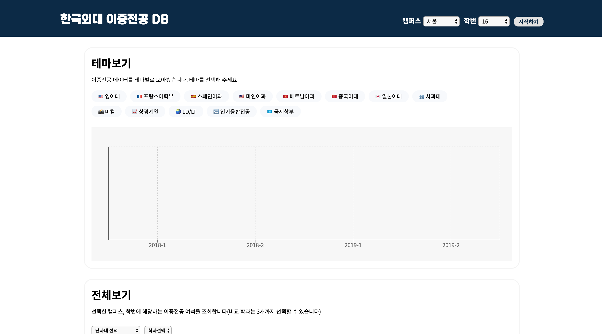

# HUFS-Second-Major-Visualize

### 🎓✌🏻📊

  
   
한국외대 이중전공 변경 여석 데이터 시각화 서비스

## ✔️ 주요 기능

- 설캠, 글캠의 학번별 이중전공 변경 여석을 시각화된 그래프를 통해 쉽게 확인할 수 있습니다.
- **4학기 동안**의 이중전공 여석을 한 번에 볼 수 있어 관심있는 학과의 변경 여석 추이를 확인할 수 있습니다.
- 여석이 없어 당장 이중전공 변경을 못하는 경우라도, 다음학기 변경 여석을 예상해볼 수 있습니다.
- 인기있는 이중전공(상경계열, 미컴 등)들의 데이터를 따로 확인할 수 있습니다.
- 여러 학과의 이중전공 여석을 비교해서 볼 수 있습니다.
- 추가적으로 경영학과 이중전공 시험 합격률 데이터, 이중전공 신청 정보 등도 제공합니다.
- **매학기 이중전공 변경 철마다 학교 공지사항에 올라오는 엑셀 파일이 넘 가독성 떨어져서 만들어봅니다**

## ⚓️ 의존성

- [React.js(CRA)](https://github.com/facebook/react) + [TypeScript](https://github.com/microsoft/TypeScript)
- [react-redux](https://github.com/reduxjs/react-redux)
- [xlsx](https://github.com/SheetJS/sheetjs)
- [recharts](https://github.com/recharts/recharts)
- [styled-components](https://github.com/styled-components/styled-components)
- [gh-pages](https://github.com/tschaub/gh-pages)

## 🧩 프로젝트 구조

추후 업데이트 예정

## 📌 버전

[릴리즈 노트](https://github.com/MaxKim-J/HUFS-Second-Major-Visualize/releases)를 참조해주세요!

## 📈 데이터 출처

[한국외국어대학교 학사공지](http://hufs.ac.kr/)
