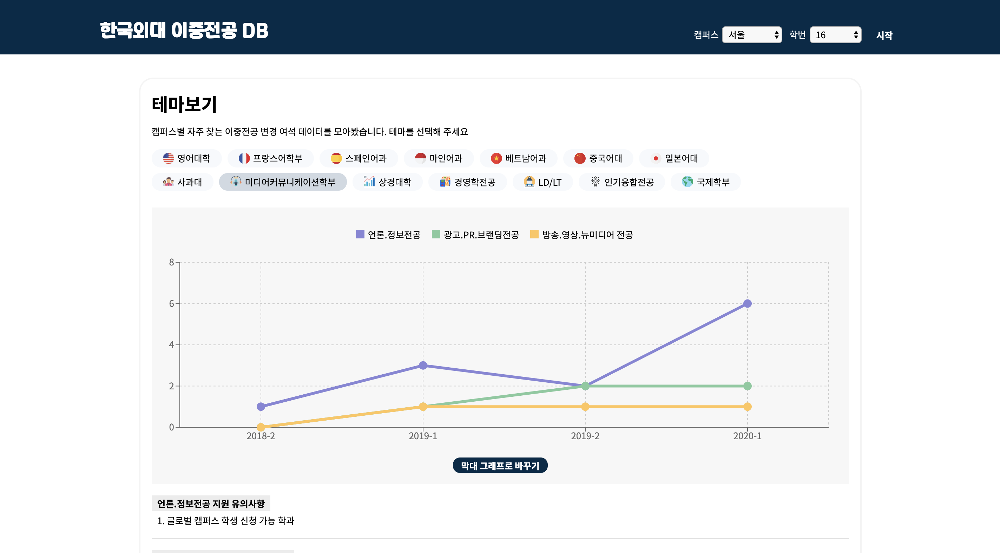

# 한국외대 이중전공 DB

### 🎓✌🏻📊

  
 

**한국외대 이중전공 변경 여석 데이터 시각화 서비스**  

[웹사이트 바로가기 ](https://maxkim-j.github.io/HUFS-Second-Major-Visualize/)

## ✔️ 주요 기능

- 설캠, 글캠의 학번별 이중전공 변경 여석을 시각화된 그래프를 통해 쉽게 확인할 수 있습니다.
- **4학기 동안**의 이중전공 여석을 한 번에 볼 수 있어 관심있는 학과의 변경 여석 추이를 확인할 수 있습니다.
- 여석이 없어 당장 이중전공 변경을 못하는 경우라도, 다음학기 변경 여석을 예상해볼 수 있습니다.
- 인기있는 이중전공(상경계열, 미컴 등)들의 데이터를 따로 확인할 수 있습니다.
- 여러 학과의 이중전공 여석을 비교해서 볼 수 있습니다.
- 추가적으로 경영학과 이중전공 시험 합격률 데이터, 이중전공 신청 정보 등도 제공합니다.
- **매학기 이중전공 변경 철마다 학교 공지사항에 올라오는 엑셀 파일이 가독성이 떨어져서 만들어봅니다**

## 📖 Key Note

### 프로젝트 구조/스택

#### TypeScript

- [TypeScript](https://github.com/microsoft/TypeScript)를 파서와 리액트 앱에 모두 도입했습니다.
- 파싱된 결과와 정보들을 Type으로 선언하여(ParsingResult, BaParsingResult) 명확한 정적 타이핑을 구현했습니다.
- 각 컴포넌트의 Prop에 해당하는 값들을 미리 Type으로 선언하여 Prop의 Type을 validation할 수 있었습니다. 

#### Parser

- [xlsx](https://github.com/SheetJS/sheetjs)(sheet.js) 라이브러리를 이용해 이중전공 관련 데이터가 기록된 엑셀파일을 파싱해 JSON 객체로 바꿀 수 있었습니다. 

#### React App

- 파싱된 결과인 JSON 파일을 앱 디렉토리에 저장해놨다가, 유저가 학번과 캠퍼스를 입력하면 해당 정보에 해당하는 ParsingResult, BaParsingResult를 JSON 파일의 일부에서 redux store로 가져옵니다.
- store은 연결된 ChartContainer로 데이터를 전달합니다. recharts.js를 통해 전달받은 데이터를 시각화합니다.
- 유저 입력이 들어온 후에 ChartContainer 컴포넌트들을 동적 임포트하는 방법으로 초기 로딩 속도를 개선했습니다. 
- [React.js(CRA)](https://github.com/facebook/react)
- [react-redux](https://github.com/reduxjs/react-redux)
- [recharts](https://github.com/recharts/recharts)
- [styled-components](https://github.com/styled-components/styled-components)

#### deploy

- [gh-pages](https://github.com/tschaub/gh-pages)를 이용해 배포했습니다.
- URL : https://maxkim-j.github.io/HUFS-Second-Major-Visualize

## 📌 버전

[릴리즈 노트](https://github.com/MaxKim-J/HUFS-Second-Major-Visualize/releases)를 참조해주세요!

## 📈 데이터 출처

[한국외국어대학교 홈페이지 학사공지란](http://hufs.ac.kr/)
